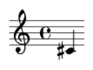
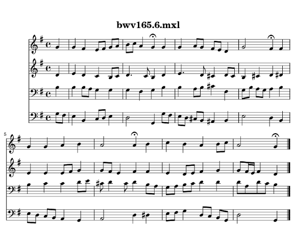

[](https://travis-ci.org/jtrecenti/music21)

<!-- README.md is generated from README.Rmd. Please edit that file -->
**Under development. Please contribute.**

music21
=======

The goal of `music21` is to have an pipe-able API of [music21 python library](http://web.mit.edu/music21/doc/index.html). It uses RStudio's excellent [`reticulate`](https://github.com/rstudio/reticulate) package in the backend.

In practice, `music21` is more limited than the python library. However, it is really easy to run any functions from `music21` inside R.

Installation
------------

You can install `music21` from github with:

``` r
# install.packages("devtools")
devtools::install_github("jtrecenti/music21")
```

`music21` object
----------------

``` r
library(music21)
music21
#> Module(music21)
```

`music21` object stores the python module. It is possible to run any function from it just by using `$`, treating it as a Reference Class object.

``` r
note <- music21$note$Note("C#")
note
```

&lt;music21.note.Note C\#&gt;

``` r
note %>% 
  plot()
```



Example
-------

### Show bach chorales

``` r
get_composer("bach") %>% 
  head()
#> [1] "/usr/local/lib/python2.7/dist-packages/music21/corpus/bach/bwv1.6.mxl"  
#> [2] "/usr/local/lib/python2.7/dist-packages/music21/corpus/bach/bwv10.7.mxl" 
#> [3] "/usr/local/lib/python2.7/dist-packages/music21/corpus/bach/bwv101.7.mxl"
#> [4] "/usr/local/lib/python2.7/dist-packages/music21/corpus/bach/bwv102.7.mxl"
#> [5] "/usr/local/lib/python2.7/dist-packages/music21/corpus/bach/bwv103.6.mxl"
#> [6] "/usr/local/lib/python2.7/dist-packages/music21/corpus/bach/bwv104.6.mxl"
```

Let's get one of these paths and read:

``` r
bach_music <- get_composer("bach")[61] %>% 
  read_music()
```

### Plot bwv165.6 music

Now let's plot the music!

``` r
bach_music %>% 
  plot()
```



In RStudio, you can use the `view` function to see the music inside viewer pane.

### Print bwv165.6 music (soprano part)

``` r
bach_music[[1]]
#> {0.0} <music21.instrument.Instrument P1: Soprano: Instrument 1>
#> {0.0} <music21.stream.Measure 0 offset=0.0>
#>     {0.0} <music21.clef.TrebleClef>
#>     {0.0} <music21.key.Key of G major>
#>     {0.0} <music21.meter.TimeSignature 4/4>
#>     {0.0} <music21.note.Note G>
#> {1.0} <music21.stream.Measure 1 offset=1.0>
#>     {0.0} <music21.note.Note G>
#>     {1.0} <music21.note.Note F#>
#>     {2.0} <music21.note.Note E>
#>     {2.5} <music21.note.Note F#>
#>     {3.0} <music21.note.Note G>
#>     {3.5} <music21.note.Note A>
#> {5.0} <music21.stream.Measure 2 offset=5.0>
#>     {0.0} <music21.note.Note B>
#>     {0.5} <music21.note.Note C>
#>     {1.0} <music21.note.Note A>
#>     {2.0} <music21.note.Note G>
#>     {3.0} <music21.note.Note G>
#> {9.0} <music21.stream.Measure 3 offset=9.0>
#>     {0.0} <music21.note.Note G>
#>     {1.0} <music21.note.Note A>
#>     {1.5} <music21.note.Note G>
#>     {2.0} <music21.note.Note F#>
#>     {2.5} <music21.note.Note E>
#>     {3.0} <music21.note.Note D>
#> {13.0} <music21.stream.Measure 4 offset=13.0>
#>     {0.0} <music21.note.Note G>
#>     {2.0} <music21.note.Note F#>
#>     {3.0} <music21.note.Note F#>
#> {17.0} <music21.stream.Measure 5 offset=17.0>
#>     {0.0} <music21.layout.SystemLayout>
#>     {0.0} <music21.note.Note G>
#>     {1.0} <music21.note.Note G>
#>     {2.0} <music21.note.Note A>
#>     {3.0} <music21.note.Note B>
#> {21.0} <music21.stream.Measure 6 offset=21.0>
#>     {0.0} <music21.note.Note A>
#>     {2.0} <music21.note.Note A>
#>     {3.0} <music21.note.Note B>
#> {25.0} <music21.stream.Measure 7 offset=25.0>
#>     {0.0} <music21.note.Note C>
#>     {1.0} <music21.note.Note B>
#>     {2.0} <music21.note.Note A>
#>     {3.0} <music21.note.Note B>
#>     {3.5} <music21.note.Note C>
#> {29.0} <music21.stream.Measure 8 offset=29.0>
#>     {0.0} <music21.note.Note A>
#>     {2.0} <music21.note.Note G>
#>     {3.0} <music21.bar.Barline style=final>
```
